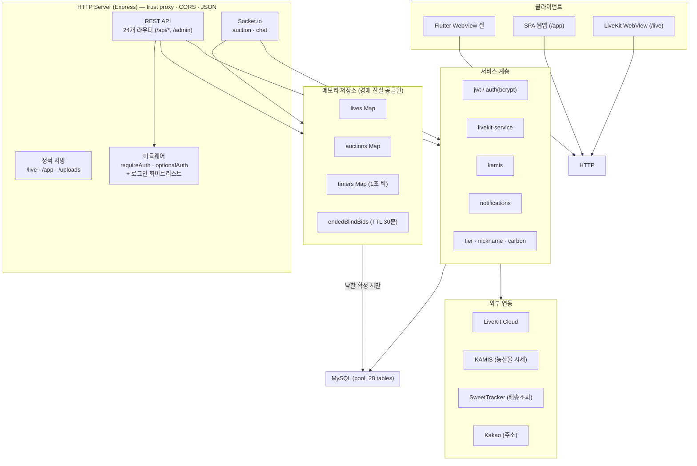

# Barofarm 서버 아키텍처

P2C 산지직송 라이브 커머스 플랫폼 서버 구성도.

- **스택:** Node.js + Express + Socket.io + MySQL(mysql2) · TypeScript
- **진입점:** `server/src/index.ts`
- **정적 서빙:** `/live`(LiveKit HTML), `/app`(SPA 웹앱, no-cache), `/uploads`, `/` → `/app/home`

## 전체 구성도



## REST API 라우터 (`src/routes/` · `/api/*` 프리픽스)

| 도메인 | 라우터 |
|--------|--------|
| **인증/유저** | `auth` (JWT+bcrypt), `users`, `notifications` |
| **라이브/경매** | `lives`(io 주입), `live`(LiveKit 토큰), `auctions` |
| **상품/거래** | `products`(io), `group-deals`(io), `favorites`(io,pool), `wishlist`(pool), `reviews`, `search`, `recommendations` |
| **주문/배송** | `tracking`, `timelines`, `delivery-addresses`, `payment-methods`, `refunds`, `consignments` |
| **시세/제휴** | `market-prices`, `hanaro-stores` |
| **채팅** | `chat-rooms` |
| **관리** | `admin` (`/admin`, io 주입) |

`io`/`pool`을 주입받는 라우터(`createXxxRouter`)는 REST 처리 중 소켓 브로드캐스트·DB 접근을 직접 수행한다.

## Socket.io 실시간 계층 (`src/socket/`)

### `registerAuctionSocket(io)`
- **수신:** `join`, `bid`, `bid:blind`, `giveaway:join`, `purchase`, `emoji:react`, `viewer:list:get`, `user:identify`, `disconnect`
- **발신:** `auction:update`, `auction:ended`, `viewer:count`, `viewer:list`, `viewer:join`, `bid:blind:ack`, `blind:bid:count`, `purchase:made`, `giveaway:count`, `giveaway:join:ack`, `emoji:reaction`

### `registerChatSocket(io)`
- **수신:** `cr:join`, `cr:leave`, `cr:send`, `chat`
- **발신:** `cr:message`, `cr:unread`, `cr:member_count`, `cr:error`, `chat:message`

## 경매 상태 저장소 (`src/store/memory.ts`) — 핵심

```
메모리(Map) = 경매 진실 공급원
├─ lives           Map<id, LiveState>     라이브 방
├─ auctions        Map<id, AuctionState>  진행 중 경매 (4모드: normal/fcfs/blind/giveaway)
├─ timers          Map<id, Timeout>       1초 틱 카운트다운
└─ endedBlindBids  Map (TTL 30분)         블라인드 종료 후 입찰 보관

낙찰 확정 시에만 → MySQL 저장 (CLAUDE.md 핵심 원칙 3)
```

## 서비스 계층 (`src/services/`)

| 서비스 | 역할 |
|--------|------|
| `jwt` | access/refresh 토큰 서명·검증 |
| `auth` | bcrypt 비밀번호 해싱·검증 |
| `livekit-service` | LiveKit 룸 삭제·경매 종료 |
| `kamis` | 농산물 도매 시세 조회·캐싱 |
| `notifications` | 알림 생성·관심사 타겟팅·소켓 푸시 |
| `tier` | 구매자/판매자 등급 |
| `nickname` | 랜덤 닉네임 생성 |
| `carbon` | 탄소 배출 계산 |

## 외부 연동 (환경변수)

| 서비스 | 용도 | 환경변수 |
|--------|------|----------|
| LiveKit Cloud | 영상 스트리밍 | `LIVEKIT_URL` / `LIVEKIT_KEY` / `LIVEKIT_SECRET` |
| KAMIS API | 농산물 도매 시세 | `KAMIS_ID` / `KAMIS_KEY` |
| SweetTracker | 택배 배송 조회 | `SWEETTRACKER_API_KEY` |
| Kakao API | 주소/우편번호 | `KAKAO_REST_API_KEY` |
| MySQL | 데이터 저장 | `DB_HOST` / `DB_USER` / `DB_PASS` / `DB_NAME` |
| (공통) | 인증·CORS·포트 | `JWT_SECRET` / `CORS_ORIGINS` / `PORT` / `HOST` |

## 데이터 계층 (MySQL, 28개 테이블)

- **유저:** `users`, `follows`, `subscriptions`, `notifications`
- **경매/라이브:** `lives`, `auctions`, `bids`
- **상품/거래:** `products`, `product_images`, `favorites`, `wishlist`, `reviews`, `group_deals`, `group_deal_participants`, `consignments`, `consignment_images`
- **주문/배송:** `delivery_addresses`, `delivery_timeline`, `payment_methods`, `refunds`, `settlements`
- **채팅:** `chat_rooms`, `chat_room_members`, `chat_room_messages`, `chats`/`chat_messages`, `direct_messages`
- **시세:** `market_prices`

> 마이그레이션(`db/migrations/*.sql`)은 서버 시작 시 자동 적용되지 않는다 — 수동 실행 필요:
> `SOURCE server/db/migrations/NNN_xxx.sql;`
