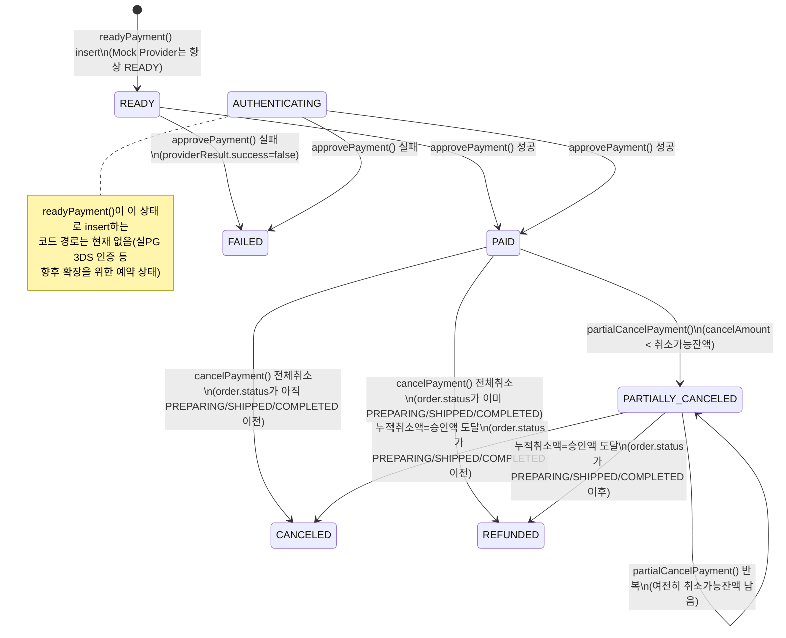
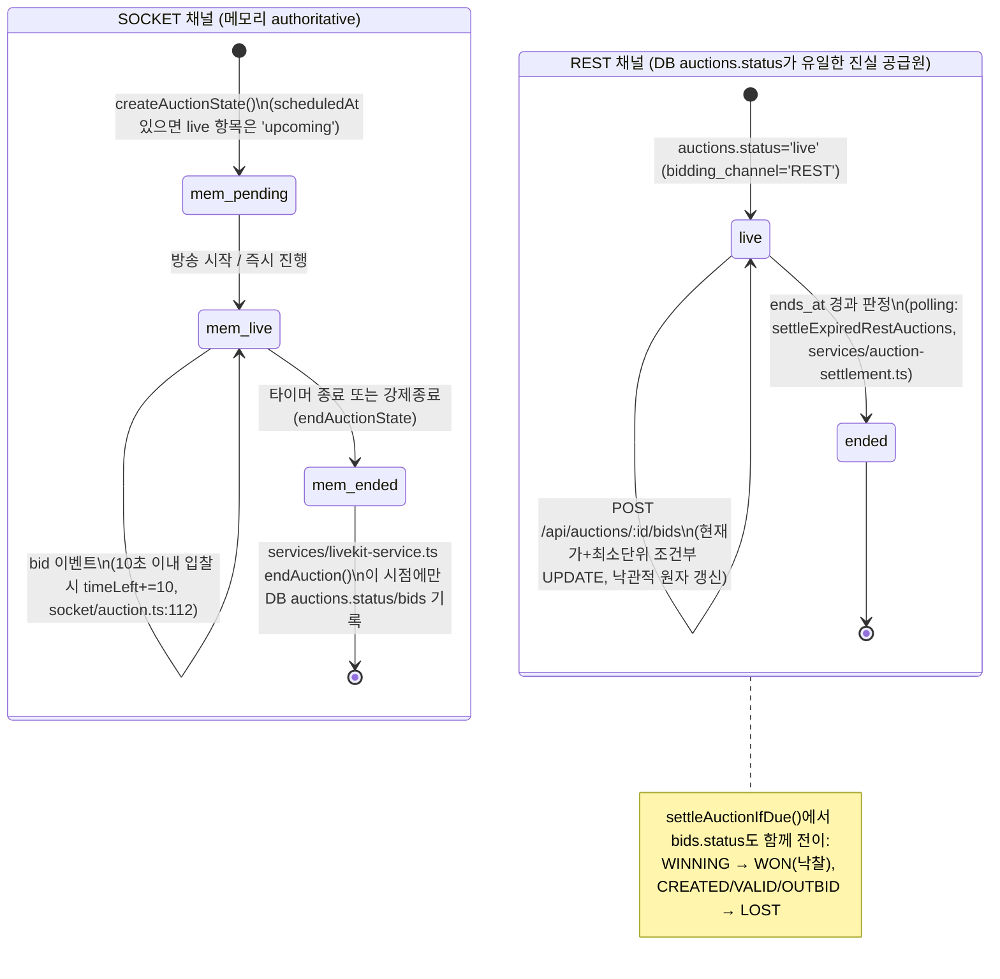
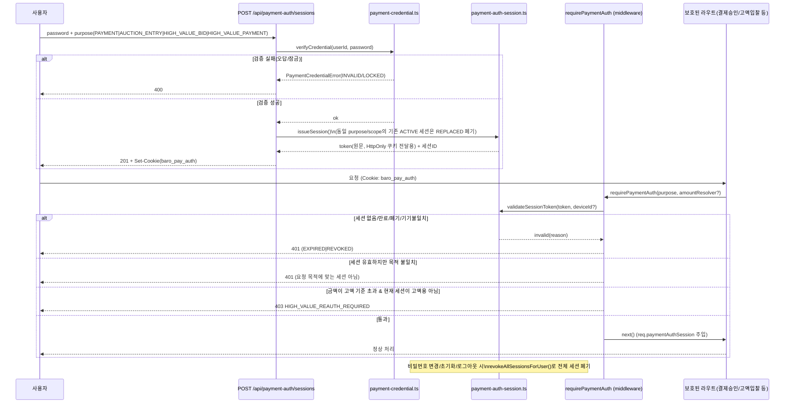
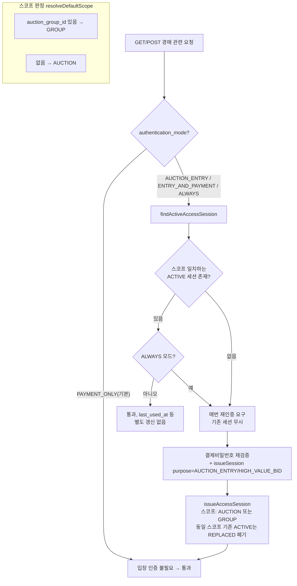
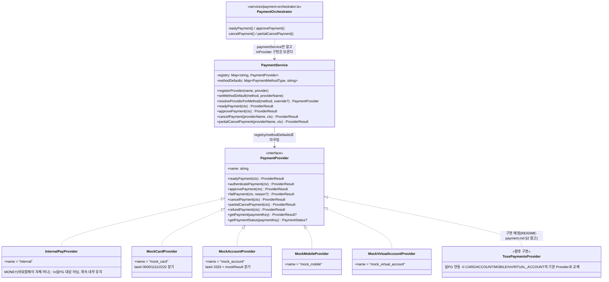

# 결제 시스템 다이어그램 (Phase 8)

실제 코드(`services/payment-orchestrator.ts`, `socket/auction.ts`, `routes/auction-bids.ts`,
`services/auction-settlement.ts`, `services/payment-auth-session.ts`, `middleware/payment-auth.ts`,
`services/auction-access.ts`, `services/payment/`)를 기준으로 작성했다. 코드에 없는 전이는 포함하지 않았다.

## 1. 결제 상태전이 (`payments.status`)

`services/payment-orchestrator.ts`의 `transitionPayment()`만이 `payments.status`를 바꾸는 유일한 경로다
(from 목록에 없는 상태에서 호출되면 `INVALID_PAYMENT_STATUS`로 거부됨). `AUTHENTICATION_REQUIRED` /
`AUTHENTICATING`(진입) / `AUTHORIZED` / `EXPIRED`는 `PaymentRowStatus` 타입과 `transitionPayment`의 허용
`from` 목록에는 존재하지만, 현재 Mock Provider 흐름(`readyPayment`가 항상 `READY`로 insert)에서는 실제로
도달하는 코드 경로가 없다 — 실 PG 3DS 인증 등 향후 확장을 위해 타입만 예약되어 있는 상태다(점선으로 표시).

approve 실패 시 `payments.status`만 별도 트랜잭션으로 `FAILED`로 기록되고(포인트/머니 차감은 같은
트랜잭션 안에서 롤백됨), 멱등 재요청(`payment_transactions.idempotency_key` 재사용)은 상태 전이 없이
기존 결과를 그대로 반환한다(`findIdempotentReplay`).

---

## 2. 경매 상태전이

기존 소켓 경매(`socket/auction.ts` + `store/memory.ts`, `bidding_channel='SOCKET'`)와 REST 인증형 입찰
(`routes/auction-bids.ts` + `services/auction-settlement.ts`, `bidding_channel='REST'`)은 서로 다른 "진실
공급원"을 쓴다 — 전자는 메모리(`AuctionState.status`)가 authoritative이고 DB `auctions.status`는 낙찰
시점에만 기록되며, 후자는 처음부터 DB `auctions.status`/`ends_at`이 유일한 진실 공급원이다.

REST 채널 입찰(`placeBid`, `routes/auction-bids.ts`)은 단일 트랜잭션 안에서 `auctions` 행을 `FOR UPDATE`로
잠그고, 채널/진행상태/서버시간 만료(`ends_at <= NOW()`, DB 서버 시간 기준)/최소입찰단위를 검증한 뒤
`WHERE current_price < ?` 조건부 `UPDATE`로 현재가를 원자적으로 갱신한다(동시입찰/종료직전입찰 방지).

---

## 3. 결제 인증세션 흐름

`services/payment-auth-session.ts`(세션 발급/검증/폐기) + `middleware/payment-auth.ts`
(`requirePaymentAuth`/`requireAuctionAccess`)를 기준으로 한다.

만료 정책은 목적별로 분리되어 있다(`config/payment-policy.ts` `authSessionPolicy`): 비활동 만료(슬라이딩
윈도우, 매 검증 시 연장되지만 절대만료는 넘지 않음) + 절대만료(발급 시점 고정). 고액 기준 초과 여부는
`exceedsHighValueThreshold()`가 판정하며, 경매별 `high_value_reauth_amount`가 있으면 config 기본값보다
우선한다.

---

## 4. 경매장 입장 인증 흐름

`services/auction-access.ts` 기준. `auctions.authentication_mode`가 `AUCTION_ENTRY` 이상일 때만 입장
인증(`auction_access_sessions`)이 필요하고, `PAYMENT_ONLY`(기본값)는 입장 인증 없이 바로 참여 가능하다.

`assertCanParticipate()`가 스코프/모드 판정과 별개로 항상 먼저 검사하는 것: 이미 종료된 경매(`status=
'ended'`) → 거부, 판매자 본인 → 거부, 계정 상태 `suspended` → 거부. 고액 입찰(`requiresHighValueBidReauth`)은
입장 인증과 별개로 `payment_auth_sessions`(purpose=`HIGH_VALUE_BID`)를 추가로 요구한다(§3 참고).

---

## 5. Provider Adapter 구조

`services/payment/index.ts`가 유일한 배선 지점이다 — `paymentService.registerProvider(...)` +
`paymentService.setMethodDefault(method, providerName)`만 바꾸면 상위 계층(오케스트레이터/라우트) 코드
변경 없이 실제 PG로 교체된다(§README-payment.md 2절 참고).
